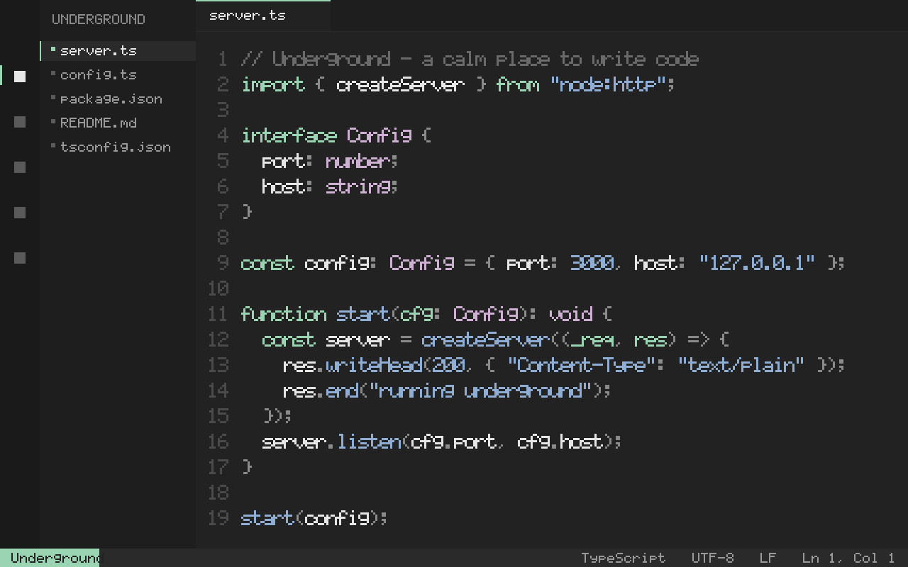

# Underground

A refined minimalist dark theme for VS Code and Kiro IDE. Low-contrast, distraction-free, with a warm green accent.

## Preview



### Palette

| Role | Color | Hex |
|------|-------|-----|
| Background | ⬛ | `#222222` |
| Foreground | ⬜ | `#ffffffde` |
| Keywords/Tags/Parameters | 🟢 | `#9bd4b2` |
| Strings/Functions/Numbers | 🔵 | `#90aed3` |
| Types/Attributes | 🟣 | `#ceb0d3` |
| Comments | ⚫ | `#6a6a6a` |
| Errors | 🔴 | `#e29090` |
| Warnings | 🟡 | `#f7df9b` |
| Info/Links | 🔵 | `#81a2be` |
| Selection/find match | 🌫️ | `#353535` |

## Highlights

- Warm, low-contrast dark background (`#222222`) that reduces eye strain
- Green (`#9bd4b2`) for keywords, tags, and parameters
- Blue (`#90aed3`) for strings, functions, numbers, and `this`
- Purple (`#ceb0d3`) for types, classes, and attributes
- Comments in italic with a subtle gray (`#6a6a6a`)
- Green active borders (`#9bd4b2`) on focused panels
- Semantic highlighting enabled for better TypeScript/JS support
- Matching Windows Terminal color scheme

## Installation

### VS Code / Kiro IDE

1. Copy this folder to your extensions directory:
   - **macOS**: `~/.vscode/extensions/` or `~/.kiro/extensions/`
   - **Linux**: `~/.vscode/extensions/` or `~/.kiro/extensions/`
   - **Windows**: `%USERPROFILE%\.vscode\extensions\` or `%USERPROFILE%\.kiro\extensions\`

2. Restart VS Code / Kiro IDE

3. Open Command Palette (`Cmd+Shift+P`) → "Preferences: Color Theme" → Select **Underground**

### Alternative: Symlink (for development)

```bash
# VS Code
ln -s ~/projects/underground-theme/editors/vscode ~/.vscode/extensions/underground-theme

# Kiro IDE
ln -s ~/projects/underground-theme/editors/vscode ~/.kiro/extensions/underground-theme
```

## Recommended Settings

```json
{
  "editor.fontFamily": "JetBrains Mono, Fira Code, monospace",
  "editor.fontSize": 13,
  "editor.lineHeight": 1.6,
  "editor.cursorBlinking": "phase",
  "editor.bracketPairColorization.enabled": false,
  "editor.minimap.enabled": false,
  "editor.renderWhitespace": "none",
  "editor.overviewRulerBorder": false,
  "workbench.tree.indent": 16
}
```

## License

MIT — see [LICENSE](../../LICENSE).
